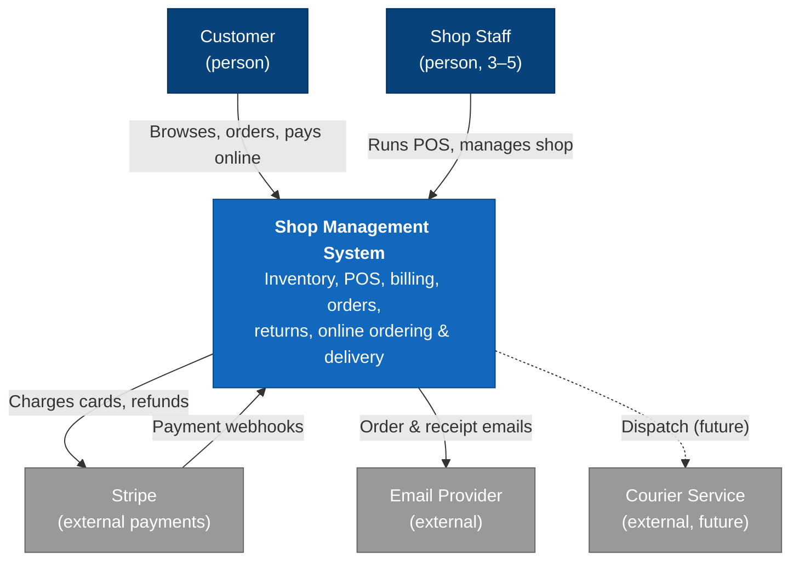
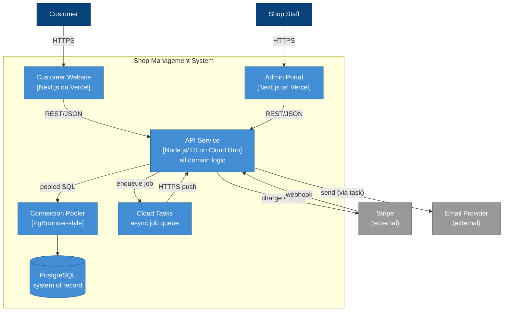
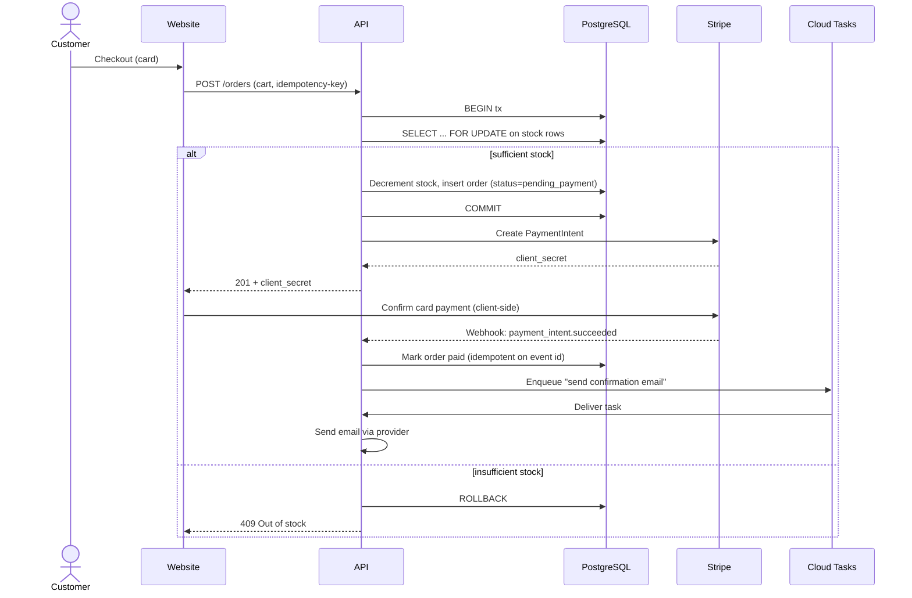
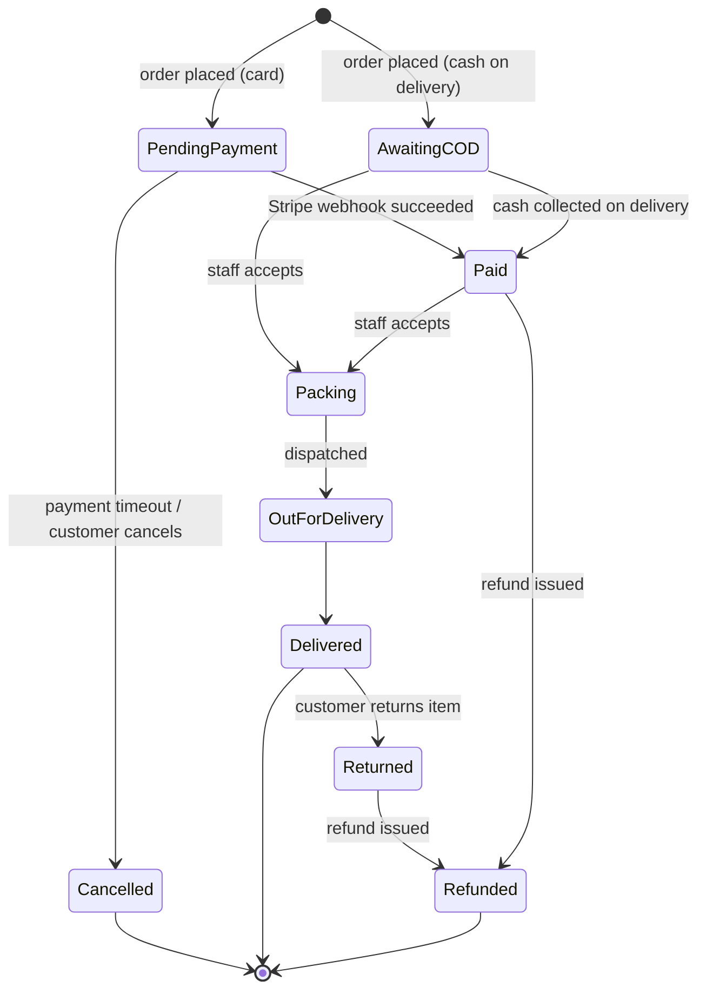
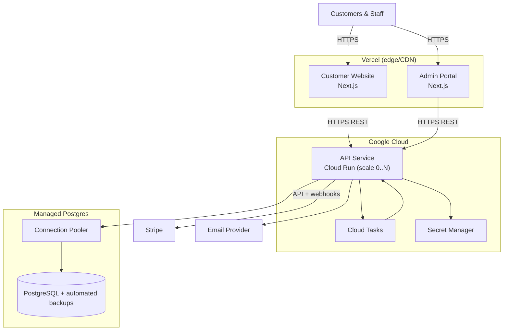

# Architecture: Shop Management System

> Status: Draft · Last updated: 2026-06-18 · Author: zeeshan23am

## 1. Introduction and Goals

The Shop Management System is the software backbone for a single retail shop. It
serves two audiences from one core: **shop staff**, who run inventory, point-of-sale
checkout, billing and invoicing, returns and refunds, and customer records through an
admin portal; and **customers**, who browse, order online, and receive delivery through
a public website. A single backend API is the system of record for both.

The defining requirement is **correctness of money and stock**: the shop must never lose
a sale, never double-charge or double-record a transaction, and never sell stock it does
not have. Everything else is negotiable; this is not.

### Top quality goals (ranked)

| # | Quality goal | Why it leads |
|---|--------------|--------------|
| 1 | **Transactional integrity** | "Never lose a sale or transaction" is the stated north star. Drives the choice of a relational store with ACID transactions, idempotent payment handling, and row-level locking on stock. |
| 2 | **Solo-operable simplicity** | One person builds *and* runs this. Every increment of complexity is a tax that person pays forever. Pushes toward a single language, a modular monolith, and managed infrastructure over anything self-operated. |
| 3 | **Low running cost** | Single-shop, small business. Favors scale-to-zero serverless, free/low tiers, and avoiding always-on infrastructure (no standing message broker, no Kubernetes). |

These three, in this order, are the tie-breakers for every decision below. When
simplicity and flexibility conflict, simplicity wins; when either conflicts with
transactional integrity, integrity wins.

## 2. Constraints

| Constraint | Detail |
|------------|--------|
| **Team** | One engineer (the author), full-stack, strongest in **TypeScript**. Python/FastAPI acceptable only if something genuinely demands it — nothing here does. |
| **Language mandate** | TypeScript end-to-end (API + both frontends). |
| **Hosting** | API on **Google Cloud Run**; **managed PostgreSQL**; admin portal and customer site on **Vercel** (free tier). |
| **Payments** | **Stripe** (card) and **cash on delivery** at launch. |
| **Notifications** | **Email** only at launch. |
| **Connectivity** | Shop has reliable internet — **online-only**, no offline POS required. |
| **Extensibility** | Delivery is shop-managed now; a **third-party courier integration** is expected later and must not require a redesign. |
| **Budget / ops** | Minimal. No standing infrastructure that bills 24/7 unless it earns its place. |

These constraints are *why the architecture is not something else* — e.g. why there is no
Kafka, no Kubernetes, no microservices, and no second database engine.

## 3. Context and Scope

The system sits between two groups of people and a small set of external services. Staff
operate it through the admin portal; customers through the website. It charges cards via
Stripe, sends email via an email provider, and (later) hands off deliveries to a courier.

**Key external interfaces**

- **Stripe** — outbound REST for charges/refunds; inbound **webhooks** for asynchronous
  payment confirmation (the source of truth for "card payment succeeded").
- **Email provider** (e.g. Resend / SendGrid / SES) — outbound transactional email.
- **Courier** (future) — outbound dispatch + inbound tracking webhooks. Modeled but not
  built.

## 4. Solution Strategy

The architecture in a nutshell — each item links to an ADR in section 9:

- **TypeScript everywhere** — one Node.js/TypeScript API, two Next.js frontends. One
  language, one mental model, shared types across the wire. *(ADR-001)*
- **Modular monolith** — a single deployable API with strict internal module boundaries
  aligned to the sub-domains (catalog/inventory, customers, orders, billing, payments,
  POS, fulfillment, notifications, auth). Not microservices. *(ADR-002)*
- **PostgreSQL as the single system of record** — managed, with a connection pooler in
  front to survive Cloud Run's serverless connection fan-out. ACID transactions are the
  backbone of transactional integrity. *(ADR-003)*
- **Synchronous REST, with Cloud Tasks for async side-effects** — no standing message
  broker. Background work (emails, post-payment processing) is pushed as HTTP tasks to
  the same API. *(ADR-004)*
- **Payment behind a provider abstraction** — Stripe and cash-on-delivery implement one
  interface; a future provider plugs in without touching order logic. *(ADR-005)*
- **Stock integrity via DB transactions + row locking** — overselling is prevented in the
  database, not in application memory. *(ADR-006)*
- **Two auth realms, RBAC for staff** — separate customer and staff identity; role-based
  permissions on the admin side. *(ADR-007)*
- **Managed services with a portable core** — lean on Cloud Run, managed Postgres,
  Vercel, Stripe; keep domain logic free of vendor specifics. *(ADR-008)*
- **Money as integer minor units** — never floating point. *(ADR-009)*

## 5. Building Block View

Three deployable units plus the data store, all within the system boundary.

### Building blocks

- **Customer Website (Next.js / Vercel)** — public storefront: catalog browsing, cart,
  checkout (Stripe or cash on delivery), order history, delivery status. Talks only to the
  API. Holds no business logic of its own.
- **Admin Portal (Next.js / Vercel)** — staff workspace: POS checkout, inventory and
  stock management, billing/invoicing, returns and refunds, customer records, and order
  fulfillment. Separate app from the website for security isolation and a different UX.
- **API Service (Node.js/TS / Cloud Run)** — the brain. One deployable, internally
  organized into modules with inward-pointing dependencies:
  - `catalog` — products, prices, categories.
  - `inventory` — stock levels, adjustments, the authority on "can we sell this."
  - `customers` — customer profiles and contact info.
  - `orders` — online and in-store orders, their lifecycle and state machine.
  - `billing` — invoices and receipts.
  - `payments` — provider-agnostic charge/refund, Stripe adapter, COD adapter, webhook
    handling.
  - `pos` — counter checkout flows that compose catalog + inventory + orders + payments.
  - `fulfillment` — packing/dispatch/delivery state; the future courier seam lives here.
  - `notifications` — email composition and sending (executed via Cloud Tasks).
  - `auth` — staff and customer identity, sessions, RBAC.
  - A thin `shared` kernel for money, IDs, and cross-cutting types. Modules call each
    other through explicit interfaces, never by reaching into each other's tables.
- **Connection Pooler** — multiplexes Cloud Run's many short-lived connections down to a
  bounded set the database can handle (see ADR-003).
- **PostgreSQL** — the single system of record for every entity.
- **Cloud Tasks** — managed, scale-to-zero queue for deferred work (emails, post-payment
  reconciliation). Pushes back to the API over HTTPS, so there is no separate worker
  process to operate.

## 6. Runtime View

### 6.1 Customer places an online order paid by card

This flow exercises the parts most central to the north star: reserving stock without
overselling, charging exactly once, and confirming only on Stripe's authoritative signal.

Key points: stock is decremented inside a transaction with `FOR UPDATE` locks so two
simultaneous orders cannot both claim the last unit; the order is only marked **paid** on
the Stripe **webhook**, not on the client confirmation (the client can be lied to or drop
off); and the webhook handler is **idempotent** on Stripe's event id, so a redelivered
webhook never double-processes. A reservation that is never paid is released by a timeout
sweep (see ADR-006).

### 6.2 Cash-on-delivery order

Identical up to order creation, but the COD payment adapter marks the order
`awaiting_payment_on_delivery` instead of calling Stripe. Stock is still reserved in the
same transactional way. Payment is recorded by staff in the admin portal at delivery,
which transitions the order to `paid` and emits the receipt.

### 6.3 Order lifecycle

Cancellation and return both **restore stock** in the same transactional manner they
consumed it. Refunds go through the same payment abstraction (Stripe refund API, or a cash
refund recorded by staff).

## 7. Deployment View

- **Environments:** `dev` (local + a preview), `staging` (optional Cloud Run + a separate
  database), `prod`. Vercel gives per-branch preview deploys of both frontends for free.
- **Scaling:** Cloud Run scales to zero when idle and out under load — appropriate for a
  single shop's spiky, mostly-low traffic. A minimum-instance of 0–1 keeps cost near zero;
  raise the floor if cold starts ever bother the counter.
- **Secrets:** Stripe keys, DB credentials, email keys in **Secret Manager**, injected as
  env vars — never in source or in the frontends.
- **Networking:** all traffic HTTPS. The database is reachable only by the API (private
  connectivity / authorized networks), never by the frontends or the public internet.

## 8. Cross-cutting Concepts

**Security**
- Two identity realms: **customers** (self-service signup/login on the website) and
  **staff** (provisioned accounts on the admin portal) — separate session cookies, no
  shared credentials. RBAC on the staff side (e.g. owner vs cashier) gates refunds, price
  changes, and inventory edits (ADR-007).
- Card data **never touches the system** — Stripe's hosted/embedded elements mean the
  shop is out of PCI-DSS scope beyond the lowest self-assessment tier.
- Secrets in Secret Manager; TLS everywhere; database not publicly reachable.
- **Audit log** for money- and stock-affecting actions (refunds, manual stock
  adjustments, price overrides) — append-only, who/what/when. Cheap to add now, painful to
  reconstruct later, and directly supports the integrity goal.

**Data**
- **PostgreSQL** is the single system of record (ADR-003). Relational, transactional, with
  JSONB available for the occasional semi-structured field — no second store needed.
- **Money is stored as integer minor units** (e.g. cents) with an explicit currency, never
  as floats (ADR-009). All arithmetic in integer space.
- Schema evolves through **versioned migrations** checked into the repo (e.g. Prisma
  Migrate / Drizzle), applied in CI before the new API revision takes traffic.
- **Backups:** managed Postgres point-in-time recovery. Target **RPO ≤ 5 min, RTO ≤ 1
  hour** — generous for a single shop and met by the managed provider's defaults. Verify
  restores periodically; an untested backup is not a backup.

**Resilience and error handling**
- **Idempotency** on the two paths where double-execution costs money: client-supplied
  idempotency keys on order creation, and dedup on Stripe event ids for webhooks.
- **Stripe down:** card checkout fails closed (no order marked paid without a confirmed
  webhook); the customer is asked to retry or choose COD. Refunds queue and retry.
- **Email down:** sending runs via Cloud Tasks with **automatic retries and a dead-letter**
  path — a flaky email provider becomes a delay, never a lost order. Orders never depend on
  email succeeding.
- **Timeouts and bounded retries** on every external call; no unbounded blocking.
- **Stuck reservations** (pending payment that never completes) are swept back to stock by
  a scheduled job.

**Observability**
- Structured JSON logs from the API (Cloud Logging captures them automatically).
- Cloud Run's built-in request metrics (latency, error rate, instance count) plus a couple
  of custom counters for failed payments and out-of-stock rejections.
- **Alerting** on: API 5xx rate, webhook processing failures, and Cloud Tasks dead-letter
  arrivals. For a solo operator, alerts should be few and meaningful.

**Performance and scaling**
- The API is **stateless** (sessions in signed cookies / the database), so Cloud Run can
  add instances freely — the only shared resource is Postgres, which is why the pooler
  matters.
- Traffic is low and spiky; no caching layer is needed at launch. If catalog reads ever
  dominate, add HTTP caching at Vercel/CDN before reaching for Redis.

## 9. Architecture Decisions

### ADR-001: TypeScript end-to-end (Node.js API + Next.js frontends)

**Status:** Accepted · **Date:** 2026-06-18

**Context**
A single engineer, strongest in TypeScript, must build and maintain an API plus two web
frontends. Python/FastAPI is on the table but not preferred. The top constraint after
correctness is solo-operability.

**Decision**
We will use **TypeScript across the whole stack**: a Node.js API and two **Next.js**
applications (admin portal, customer website), with shared domain types.

**Options considered**
- **TypeScript everywhere (chosen)** — one language, one toolchain, types shared across the
  network boundary, the largest body of the author's experience. Con: Node's CPU-bound
  performance ceiling — irrelevant at this scale.
- **Python/FastAPI API + JS frontends** — fine framework, but adds a second language and a
  context switch for no benefit this system needs. Lost on the solo-simplicity goal.

**Consequences**
Fastest path to shipping for this author; one set of tooling to run; end-to-end type safety
catches whole classes of bugs. We accept Node's weaker fit for heavy CPU work — none is
foreseen, and such work could be offloaded later if it ever appears.

---

### ADR-002: Modular monolith for the API, not microservices

**Status:** Accepted · **Date:** 2026-06-18

**Context**
Nine identifiable sub-domains (catalog, inventory, customers, orders, billing, payments,
pos, fulfillment, notifications, auth), one engineer, a single shop's traffic, and a north
star of transactional integrity. No sub-domain has a materially different load or
availability profile.

**Decision**
We will build a **single deployable API** (a modular monolith) with strict internal module
boundaries aligned to the sub-domains, dependencies pointing inward, and no cross-module
table access.

**Options considered**
- **Modular monolith (chosen)** — one thing to build, deploy, and reason about; in-process
  calls and a single database make multi-entity transactions (order + stock + payment)
  trivial and atomic. Con: scales and deploys as one unit.
- **Microservices** — independent scaling/ownership. Con: turns the core order→stock→payment
  transaction into a distributed saga with eventual consistency, plus a broker, tracing, and
  orchestration to operate. That directly fights both integrity (goal 1) and solo-simplicity
  (goal 2) for scaling we do not need. Rejected.

**Consequences**
The single most important business operation stays a single ACID transaction. One service to
deploy and monitor. We accept that the whole app scales together (a non-issue at this scale)
and must enforce module discipline (lint/dependency rules) so the seams stay clean — which
keeps a future extraction cheap if the shop ever grows into a chain.

---

### ADR-003: PostgreSQL as the single system of record, with a connection pooler

**Status:** Accepted · **Date:** 2026-06-18

**Context**
The data is highly relational (products, stock, customers, orders, line items, invoices,
payments) and the system must guarantee transactional integrity over money and stock. The
API runs on Cloud Run, which can spawn many concurrent instances, each opening database
connections — and Postgres has a low connection ceiling.

**Decision**
We will use a **single managed PostgreSQL** database as the system of record, fronted by a
**connection pooler** (PgBouncer-style). A provider with a built-in pooler (e.g. Neon or
Supabase) is preferred to minimize ops; Cloud SQL + a pooler is the alternative.

**Options considered**
- **Managed Postgres + pooler (chosen)** — ACID transactions, joins, mature ecosystem, and
  the pooler solves the serverless connection-fan-out problem. Con: one more piece (the
  pooler) — eliminated if the provider bundles it.
- **NoSQL/document store** — easy horizontal scale, but no multi-document ACID transactions
  in the shape we need, and our data is relational. Rejected: fights goal 1.
- **Cloud Run direct to Postgres, no pooler** — simplest until traffic spikes exhaust
  connections and checkouts start failing. Rejected as a latent outage.

**Consequences**
Strong consistency for the operations that matter, with a familiar query model. We accept
running (or paying a provider for) a pooler, and we must treat the connection limit as a real
budget. A single primary is a scaling ceiling far above this shop's needs; read replicas can
be added later without app changes.

---

### ADR-004: Synchronous REST with Cloud Tasks for async side-effects

**Status:** Accepted · **Date:** 2026-06-18

**Context**
Most operations need an immediate answer (place order, take payment, look up stock), but a
few should not block the user or fail the order if a flaky dependency hiccups — chiefly
sending email and post-payment bookkeeping. The solo/low-cost goals argue against running a
standing message broker.

**Decision**
We will use **synchronous REST/JSON** for request/response, and **Google Cloud Tasks** for
deferred work, pushing tasks back to the same API over HTTPS. No separate broker, no
separate worker process.

**Options considered**
- **REST + Cloud Tasks (chosen)** — managed, scale-to-zero, built-in retries and
  dead-lettering; turns "email provider is down" into a delay. Con: GCP-coupled (acceptable
  per ADR-008; the calling code stays thin).
- **Standing broker (RabbitMQ/Kafka/Redis queue)** — more power and portability, but an
  always-on component to run and pay for, unjustified at this scale. Rejected.
- **Everything synchronous/inline** — simplest, but a slow or failing email provider would
  delay or break checkout. Rejected: couples order success to a non-critical dependency.

**Consequences**
Background failures retry automatically and never threaten an order; nothing extra runs when
idle. We accept coupling to Cloud Tasks, isolated behind a small queue interface so the
domain code doesn't know about it.

---

### ADR-005: Payment provider abstraction (Stripe + cash on delivery)

**Status:** Accepted · **Date:** 2026-06-18

**Context**
Launch needs Stripe card payments and cash on delivery, which behave very differently (Stripe
is async and webhook-confirmed; COD is settled in person later). More providers may come.
Order logic must not be littered with provider conditionals.

**Decision**
We will define a single **`PaymentProvider` interface** (authorize, capture, refund, plus a
webhook/settlement hook) with a **Stripe adapter** and a **CashOnDelivery adapter**. Order and
billing code depends only on the interface.

**Options considered**
- **Provider abstraction (chosen)** — both methods and any future gateway plug in uniformly;
  order code stays clean and testable with a fake provider. Con: a little upfront interface
  design.
- **Stripe hardcoded throughout** — fastest to write, but COD and any future provider would
  mean invasive rewrites of order logic. Rejected.

**Consequences**
Adding a local gateway later (the kind of thing a regional shop often needs) is an isolated
change. We accept the modest discipline of routing all payment actions through the interface,
and must keep the abstraction honest about the async, webhook-confirmed nature of card
payments (it is not a synchronous "charge now" call).

---

### ADR-006: Stock integrity via database transactions and row locking

**Status:** Accepted · **Date:** 2026-06-18

**Context**
Both the online website and the in-store POS sell from the same stock. With concurrent
checkouts, a naive read-then-write can oversell the last unit — a direct violation of the
north star.

**Decision**
Stock will be reserved and decremented **inside the same database transaction** that creates
the order, using **`SELECT ... FOR UPDATE`** row locks on the affected stock rows. Insufficient
stock rolls the transaction back and rejects the order. Cancellations, returns, and unpaid-
reservation timeouts restore stock the same transactional way.

**Options considered**
- **Transactional locking in Postgres (chosen)** — the database enforces the invariant; correct
  under any concurrency. Con: locks briefly serialize sales of the *same* product — negligible
  at this volume.
- **Application-level checks / optimistic counters** — works until two requests interleave;
  reintroduces the oversell risk we are trying to eliminate. Rejected.
- **External lock service (Redis, etc.)** — extra infrastructure for a guarantee Postgres
  already provides for free. Rejected.

**Consequences**
Overselling is structurally impossible, not merely unlikely. We accept brief per-product lock
contention (irrelevant here) and must run a **sweep job** to release reservations from orders
that never complete payment, so abandoned card checkouts don't strand stock.

---

### ADR-007: Two identity realms with role-based access for staff

**Status:** Accepted · **Date:** 2026-06-18

**Context**
Two very different audiences: a handful of trusted staff with powerful capabilities (refunds,
price and stock edits) and an open population of self-registering customers. Conflating them is
a security risk.

**Decision**
We will keep **separate authentication realms** — staff accounts (provisioned, on the admin
portal) and customer accounts (self-service, on the website) — with **role-based access
control** on the staff side gating money- and stock-affecting actions. Sessions are stateless
(signed cookies / DB-backed), keeping the API horizontally scalable. A well-vetted library
(e.g. Auth.js / Lucia) is preferred over a hand-rolled scheme.

**Options considered**
- **Two realms + RBAC (chosen)** — least privilege, clear blast-radius separation, simple roles
  for a tiny staff. Con: two login flows to build.
- **Single user table with a role flag** — fewer moving parts, but one bug could expose admin
  capability to a customer account; muddier audit story. Rejected on security.
- **Managed external auth (Clerk/Auth0)** — offloads auth entirely, but adds cost and a
  dependency for needs a library covers fine at this scale. Reasonable future option, not now.

**Consequences**
Customer and staff capabilities are cleanly separated and auditable. We accept building and
maintaining two auth flows, and must protect sensitive staff actions with both RBAC and audit
logging (see §8).

---

### ADR-008: Managed services with a portable core (lock-in stance)

**Status:** Accepted · **Date:** 2026-06-18

**Context**
The deployment targets (Cloud Run, managed Postgres, Vercel, Stripe, Cloud Tasks) are
provider-managed. A solo operator benefits enormously from offloading ops, but total coupling
can make a future move expensive. This trade-off should be made deliberately, not by accident.

**Decision**
We will **use managed services freely for undifferentiated heavy lifting**, while keeping the
**core domain logic free of provider-specific code**. Provider touchpoints (queue, payments,
email, storage) sit behind thin interfaces; the domain modules depend on the interfaces.

**Options considered**
- **Managed + portable core (chosen)** — maximum delivery speed and minimum ops now, while the
  expensive-to-move part (domain logic) stays movable. Con: a little interface boilerplate.
- **Maximally portable (self-hosted everything, abstractions everywhere)** — cloud-agnostic, but
  the ops burden directly contradicts the solo-simplicity goal. Rejected for now.
- **Maximally coupled (provider SDKs sprinkled through domain code)** — fastest to type, but a
  later migration becomes a rewrite. Rejected as needless lock-in.

**Consequences**
We move fast and run almost nothing ourselves. Postgres and the domain logic are the portable
heart; the managed conveniences around them (Cloud Run, Cloud Tasks, Vercel) are replaceable
with contained effort. We accept GCP/Vercel/Stripe coupling at the edges as a conscious,
bounded cost.

---

### ADR-009: Represent money as integer minor units

**Status:** Accepted · **Date:** 2026-06-18

**Context**
The system's whole reason for being is not losing or miscounting money. Floating-point
arithmetic introduces rounding errors that are unacceptable for currency.

**Decision**
All monetary values are stored and computed as **integer minor units** (e.g. cents) with an
explicit currency code. No floating-point money anywhere; formatting to decimals happens only
at display time.

**Options considered**
- **Integer minor units (chosen)** — exact arithmetic, the industry-standard approach (and what
  Stripe itself uses). Con: must format for display.
- **Floating-point** — convenient, but accumulates rounding error. Rejected outright.
- **Arbitrary-precision decimal type** — also exact, but heavier and easy to misuse across the
  JS/DB/Stripe boundary where everyone already speaks integer cents. Integers are the simpler
  exact option.

**Consequences**
Money math is exact end to end and aligns with Stripe's API. We accept a formatting step at the
edges and must enforce the convention consistently (a `Money` type in the shared kernel).

## 10. Quality Requirements

| Scenario | Measure |
|----------|---------|
| Two concurrent checkouts for the last unit of a product | Exactly one succeeds; the other gets a clean out-of-stock rejection. No negative stock, ever. |
| Stripe redelivers a `payment_intent.succeeded` webhook | Order is marked paid exactly once; no duplicate receipt, no double fulfillment. |
| Email provider is unavailable for 30 minutes | Zero orders fail or are lost; confirmation emails are retried and delivered once it recovers. |
| Card checkout where the customer abandons after order creation | Reserved stock is released by the sweep job within the configured timeout. |
| Database loss event | Recover with **RPO ≤ 5 min, RTO ≤ 1 hour** from managed point-in-time backups. |
| Idle period (shop closed) | Infrastructure cost trends toward zero (Cloud Run at 0 instances, Vercel free tier). |

## 11. Risks and Technical Debt

- **Online-only POS.** If the shop's internet drops, the counter cannot take sales. Accepted
  per the stated reliable-connectivity assumption. If outages prove real, revisit with a
  local-first POS — a significant change, deliberately deferred. The clean `pos` module
  boundary is what keeps that door open.
- **Single database, single region.** A regional outage or a corrupting bug takes the system
  down until recovery. Acceptable for one shop given the RTO target; mitigated by managed
  backups and PITR. Read replicas / multi-region are future options, not launch needs.
- **Solo bus factor.** One person holds all the context. Mitigation: this document, the ADRs,
  versioned migrations, and disciplined module boundaries — so a second engineer (or future
  self) can onboard.
- **Auth built in-house (on a library).** Cheaper than a managed provider but security-
  sensitive. Mitigation: use a vetted library, never hand-roll crypto, and keep migrating to a
  managed provider as a known escape hatch if requirements grow.
- **Module discipline can erode.** A monolith's clean seams decay without enforcement. Mitigation:
  lint/dependency-boundary rules in CI from day one — cheap to start, expensive to retrofit.
- **Courier integration is modeled but unproven.** The `fulfillment` seam is designed for it, but
  no real courier API has been validated. Revisit interface details when a specific provider is
  chosen.

## 12. Glossary

| Term | Meaning |
|------|---------|
| **POS** | Point of sale — the in-store checkout flow run by staff. |
| **COD** | Cash on delivery — customer pays in person when the order arrives. |
| **System of record** | The authoritative data store; here, PostgreSQL. |
| **Idempotency** | A repeated operation has the same effect as doing it once — critical for payments and webhooks. |
| **Modular monolith** | One deployable application internally divided into strict, independently reasoned-about modules. |
| **RPO / RTO** | Recovery Point Objective (max acceptable data loss) / Recovery Time Objective (max acceptable downtime). |
| **Minor units** | The smallest currency denomination (e.g. cents) used for exact money arithmetic. |
</content>
</invoke>
