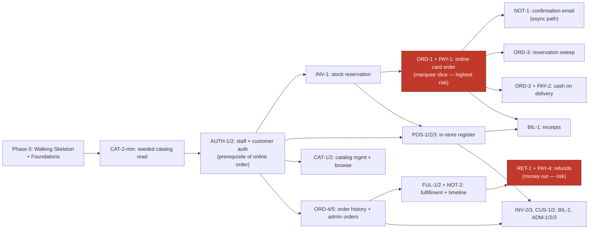

# Implementation Plan: Shop Management System

> Status: Draft · Last updated: 2026-06-18
> Inputs: docs/architecture.md · docs/ux-foundations.md

## 1. Overview

This plan turns the architecture and UX foundations into an executable build order
for a solo developer. The product is a modular-monolith API (Cloud Run + Supabase
Postgres) behind two Next.js surfaces — an admin portal and a customer website. The
MVP covers **both channels at once**: the physical counter (POS) and online ordering
must both work before launch. There is **no fixed deadline** — the sequence is paced
by dependency and risk, and the phases are a living order, not date commitments.

**What "first" optimizes for: de-risking the scariest path.** The system's north star
is *never lose a sale or transaction*, and the riskiest mechanism that serves it — a
stock-reserving order transaction plus webhook-confirmed, idempotent card payment — is
pulled to the very front, right after the walking skeleton. If that breaks, it breaks
in week two while it's cheap to change, not after the UI is built on top of it.

**Decision: customer authentication is mandatory before any online order** (no guest
checkout). Customer auth (AUTH-2) and staff login (AUTH-1) therefore move into Phase 1
as a prerequisite of the online-order slice, which is built for a *signed-in* customer.

Because both channels share one core (catalog, inventory, orders, payments), most of
the early work is that shared spine; the two surfaces then diverge into their own UI
slices on top of it.

## 2. Walking Skeleton

The thinnest end-to-end path that proves the system runs *and deploys*, giving every
later slice somewhere to attach.

**What's real:**
- Monorepo wired (`apps/api`, `apps/admin`, `apps/web`, `packages/shared`), installs and typechecks.
- **API on Cloud Run** with `GET /health` plus one trivial domain read — `GET /catalog/ping` that runs a real query against **Supabase through the transaction pooler** and returns a seeded row.
- **Both Next.js apps deployed to Vercel**, each with its **UI shell**: admin sidebar layout (`data-surface="admin"`), web top-nav layout (`data-surface="web"`), both importing `@shop/shared/styles/tokens.css`. Each renders the result of the trivial API read on a placeholder page.
- **Migrations run in CI** against a branch database; the `0001_init.sql` schema applies cleanly.
- **CI/CD pipeline green:** typecheck + lint + (empty) test run + migrate + deploy to a preview environment.

**What's stubbed:** all domain logic, auth (a placeholder/no-op guard), payments,
notifications, and every screen beyond the placeholder page.

**Done when:** a request flows browser → Vercel app → Cloud Run API → Supabase → back,
both apps are deployed through the real pipeline, the pipeline is green, and the design
tokens render in both shells.

## 3. Epic & Feature Breakdown

The whole-app map, epics aligned to architecture modules. **Near features** (Phase 1)
are detailed; **far features** are a title plus touchpoints, elaborated when they reach
the front of the queue. Surface is noted as (admin) / (web) / (core = no UI).

### Epic Auth & Identity  *(ADR-007)*
| Feature | Value | Screens | Blocks / endpoints | Data | Flow |
|--------|-------|---------|--------------------|------|------|
| AUTH-1 Staff login + RBAC | Staff can sign in; roles gate actions | Login (admin) | `auth` (staff) | staff | Staff sign-in |
| AUTH-2 Customer auth | Customers register/sign in (required before ordering) | Sign in/Register (web) | `auth` (customer) | customers | Web sign up/in |

### Epic Catalog
| Feature | Value | Screens | Blocks / endpoints | Data | Flow |
|--------|-------|---------|--------------------|------|------|
| CAT-1 Product management | Staff create/edit products & prices | Products List, Product Editor (admin) | `catalog` CRUD | products | Manage catalog |
| CAT-2 Browse & product detail | Customers find and view products | Home, Category/Search, Product Detail (web) | `catalog` read | products, stock (read) | Browse → buy |

### Epic Inventory  *(ADR-006)*
| Feature | Value | Screens | Blocks / endpoints | Data | Flow |
|--------|-------|---------|--------------------|------|------|
| INV-1 Stock reservation service | Locks + decrements stock atomically; prevents oversell | — (core) | `inventory.reserveStock` (in order tx) | stock | (powers ORD-1, POS) |
| INV-2 Stock levels + adjustment | Staff see/adjust on-hand, audit-logged | Stock Levels, Stock Adjustment (admin) | `inventory` | stock, audit_log | Manage inventory |
| INV-3 Low-stock signals | Surface low/zero stock to staff & web | Today (admin), Product Detail (web) | `inventory` read | stock | — |

### Epic Orders & Checkout  *(core spine; runtime §6.1/6.2)*
| Feature | Value | Screens | Blocks / endpoints | Data | Flow |
|--------|-------|---------|--------------------|------|------|
| **ORD-1 Online card order** | Reserve stock + Stripe PaymentIntent + webhook→paid | Cart, Checkout-Delivery, Checkout-Payment, Confirmation (web) | `orders` create, `payments` webhook | orders, order_lines, stock, payment_events | Browse → buy (card) |
| ORD-2 Cash-on-delivery order | Place order without online payment | same checkout (COD path) (web) | `orders` create (cod) | orders, order_lines, stock | Buy (COD) |
| ORD-3 Reservation sweep job | Release stock from abandoned card checkouts | — (core, scheduled) | sweep task (Cloud Tasks/cron) | orders, stock | (supports ORD-1) |
| ORD-4 Order history & tracking | Customer sees past + current orders | Order History, Order Tracking (web) | `orders` read | orders | Track order |
| ORD-5 Orders list + detail | Staff view/triage all orders | Orders List, Order Detail (admin) | `orders` read | orders | Fulfill |

### Epic Payments  *(ADR-005 — highest-risk integration; realized inside ORD/POS/RET slices)*
| Feature | Value | Screens | Blocks / endpoints | Data | Flow |
|--------|-------|---------|--------------------|------|------|
| PAY-1 Provider abstraction + Stripe + idempotent webhook | The "confirmed, exactly once" payment backbone | (none; powers ORD-1) | `payments`: provider port, stripe adapter, `webhook.handler` | payment_events | Browse → buy (card) |
| PAY-2 COD adapter | Non-gateway payment path | (powers ORD-2) | `payments`: cod adapter | payment_events | Buy (COD) |
| PAY-3 Card-present (POS) | In-store card tender via Stripe | (powers POS-2) | `payments` stripe | payment_events | POS sale (card) |
| PAY-4 Refund | Reverse a payment (card or cash) | (powers RET-1) | `payments` refund | payment_events | Issue refund |

### Epic POS (in-store)
| Feature | Value | Screens | Blocks / endpoints | Data | Flow |
|--------|-------|---------|--------------------|------|------|
| POS-1 Register + cash sale | Ring up an in-store sale, take cash, receipt | POS/Register, Tender dialog, Receipt (admin) | `pos` checkout, `inventory` | orders, order_lines, stock | POS sale (cash) |
| POS-2 Card-present tender | Take a card at the counter | POS/Register, Tender (admin) | `pos`, `payments` | orders, payment_events | POS sale (card) |
| POS-3 Barcode scan input | Scan-to-add at the register | POS/Register (admin) | `pos`/`catalog` lookup | products | POS sale |

### Epic Fulfillment
| Feature | Value | Screens | Blocks / endpoints | Data | Flow |
|--------|-------|---------|--------------------|------|------|
| FUL-1 Fulfillment workflow | Staff advance accept→pack→out→delivered | Order Detail/Fulfillment, status timeline (admin) | `fulfillment` transitions | orders | Fulfill online order |
| FUL-2 Customer status timeline | Customer sees live order status | Order Tracking (web) | `orders` read (shared timeline) | orders | Track order |

### Epic Billing & Invoicing
| Feature | Value | Screens | Blocks / endpoints | Data | Flow |
|--------|-------|---------|--------------------|------|------|
| BIL-1 Receipts | Generate/print/email a receipt | Receipt view (admin), Confirmation (web) | `billing` | orders | POS sale / online order |
| BIL-2 Invoices list & reprint | Find and reprint invoices | Invoices & Receipts (admin) | `billing` | orders | — |

### Epic Returns & Refunds
| Feature | Value | Screens | Blocks / endpoints | Data | Flow |
|--------|-------|---------|--------------------|------|------|
| RET-1 Issue refund + restore stock | Refund (role-gated, audited) and return stock | Returns & Refunds (admin) | `payments` refund, `inventory` release, `orders` status | orders, payment_events, stock, audit_log | Issue refund |

### Epic Customers
| Feature | Value | Screens | Blocks / endpoints | Data | Flow |
|--------|-------|---------|--------------------|------|------|
| CUS-1 Customer records (admin) | Look up customers + their orders | Customers List, Customer Detail (admin) | `customers` | customers, orders | — |
| CUS-2 Profile & addresses (web) | Manage details and saved addresses | Profile & Addresses (web) | `customers` | customers, addresses | — |

### Epic Notifications  *(ADR-004)*
| Feature | Value | Screens | Blocks / endpoints | Data | Flow |
|--------|-------|---------|--------------------|------|------|
| NOT-1 Order confirmation email | Receipt/confirmation via Cloud Tasks, with retries | — (core) | `notifications` job + email port | — | Browse → buy |
| NOT-2 Fulfillment status emails | Email customer on status changes | — (core) | `notifications` job | — | Fulfill |

### Epic Admin Home & Settings
| Feature | Value | Screens | Blocks / endpoints | Data | Flow |
|--------|-------|---------|--------------------|------|------|
| ADM-1 Today dashboard | Day's takings, pending fulfillments, low stock | Today (admin) | aggregate reads | orders, stock | — |
| ADM-2 Staff & roles (owner) | Manage staff accounts/roles | Staff & Roles (admin) | `auth` admin | staff | — |
| ADM-3 Shop & payment settings (owner) | Configure shop, payment, email | Shop & Payment Settings (admin) | settings | settings | — |

### Out of MVP (Phase 4+)
Courier/delivery integration (the `fulfillment` seam), advanced catalog search/facets,
dark theme, multi-language/RTL, read replicas. Tracked but not planned in detail.

## 4. Build Sequence

Ordered by **dependency** (foundational capabilities first) and **risk** (most uncertain
ADRs pulled forward). Where they disagree, risk wins for anything that could force a
re-architecture. The MVP is everything through Phase 3; it isn't "live" until both
channels work, but each slice is demonstrable on its own.

**Phase 0 — Skeleton & foundations:** Walking Skeleton (§2) + Engineering Foundations (§6).

**Phase 1 — De-risk the core spine (the scary part, first):**
1. **CAT-2-min** — minimal catalog read + a seeded product (needed to have something sellable).
2. **AUTH-1 / AUTH-2** — staff login + customer auth. Mandatory before online ordering, so it lands here as a prerequisite of ORD-1 (kept thin: register/login/session, not the full account UI).
3. **INV-1** — transactional stock reservation (`SELECT … FOR UPDATE`). *Risk: ADR-006.*
4. **ORD-1 + PAY-1** — signed-in customer online card order: reserve stock → Stripe PaymentIntent → idempotent webhook → `paid`. **This is the marquee risk-validation slice (§5).** *Highest risk: ADR-005, ADR-003, ADR-004 converge here.*
5. **NOT-1** — confirmation email via Cloud Tasks (proves the async path). *Risk: ADR-004.*
6. **ORD-3** — reservation sweep job (closes the abandoned-checkout stock leak).

Rationale: this phase stands up real customer identity, then exercises the architecture's
headline runtime scenario end-to-end and every risky ADR at once — maximum learning on the
scariest path, with auth kept deliberately minimal so it doesn't bloat the spike.

**Phase 2 — Complete both channels (now that the spine is proven):**
7. **CAT-1** + **CAT-2** — full catalog management (admin) and browse/detail (web).
8. **POS-1 / POS-2 / POS-3** — in-store register: cash, card-present (PAY-3), barcode.
9. **ORD-2 / PAY-2** — cash-on-delivery online orders.
10. **ORD-4 / ORD-5** — order history & tracking (web), orders list & detail (admin).
11. **FUL-1 / FUL-2** + **NOT-2** — fulfillment workflow, customer timeline, status emails.
12. **BIL-1** — receipts.

**Phase 3 — Round out the MVP:**
13. **RET-1 / PAY-4** — returns & refunds (money out + stock restore). *Risk: destructive, role-gated.*
14. **INV-2 / INV-3** — stock adjustments + low-stock signals.
15. **CUS-1 / CUS-2**, **BIL-2**, **ADM-1**, **ADM-2 / ADM-3** — customers, invoices, dashboard, settings.

**Phase 4 — Post-MVP:** courier integration, search scaling, dark theme, i18n.

### Dependency graph



## 5. First Vertical Slices

Auth is now a prerequisite of online ordering, so the first slice built is customer auth,
and the marquee risk-validation slice (ORD-1) follows immediately and depends on it. Both
are specified here as the handoff to detailed design.

### Slice 1 — AUTH-2 (+AUTH-1): customer & staff authentication

**"A customer can register and sign in; a staff member can sign in."** Kept thin — identity,
session, and the route guard that ORD-1 needs — not the full account UI (profile/addresses
are CUS-2, later).

- **Flow:** ux-foundations "Sign up / sign in" (customer realm) + staff sign-in.
- **Screens:** Sign in / Register (web); Login (admin).
- **Endpoints / blocks:** `auth` module — customer register/login, staff login, stateless session (signed cookie), `requireCustomer` / `requireStaff(role)` guards (ADR-007, two realms).
- **Data:** `customers`, `staff`.
- **Acceptance:** a new customer can register, sign in, and stay signed in across requests; a staff member with a seeded `owner`/`cashier` account can sign in; protected endpoints reject unauthenticated calls; customer and staff sessions are isolated (a customer token cannot reach admin actions).

### Slice 2 — ORD-1 + PAY-1: signed-in customer places an online card order (marquee)

**"A signed-in customer places an online card order, confirmed by the Stripe webhook."**

**Why this slice:** the architecture's headline runtime scenario (§6.1) and the single
highest-risk path in the system — it converges ADR-005 (webhook-confirmed, idempotent
payment), ADR-006 (transactional stock locking), ADR-003 (transactions through the Supabase
pooler), and ADR-004 (async email via Cloud Tasks). If the architecture is wrong, this is
where we find out — cheaply.

**User flow exercised:** Sign in → browse → product → add to cart → checkout (delivery
details) → pay by card → *awaiting confirmation* → order confirmed. (The ux-foundations
"Browse → buy" flow, card branch, behind the auth guard.)

**Screens rendered (web surface):**
- Product Detail (minimal — add to cart from a seeded product)
- Cart
- Checkout — Delivery details (prefilled from the signed-in customer)
- Checkout — Payment (Stripe payment element; states: entry, pending, declined)
- Order Confirmation

**Endpoints / building blocks:**
- `POST /orders` (auth: customer; channel=online, method=card, client idempotency key) → `orders` module → `inventory.reserveStock` inside one `withTransaction` → create order `pending_payment` linked to the customer → `payments.authorize` (Stripe PaymentIntent) → returns `clientSecret`.
- `POST /payments/stripe/webhook` → `payments/webhook.handler` → verify signature → idempotent insert on `(provider, provider_event)` → mark order `paid` → enqueue NOT-1.
- Cloud Tasks → `POST /tasks/send-confirmation` → email port.

**Data touched:** `customers`, `products`, `stock`, `orders`, `order_lines`, `payment_events`.

**Acceptance criteria (what "done" means):**
1. A signed-in customer can add a seeded product to the cart and reach a confirmed order paid by a Stripe test card; an unauthenticated user is sent to sign-in before checkout.
2. Stock is decremented exactly by the quantity ordered, inside the order transaction; an order for more than on-hand is rejected with a clean out-of-stock message and **no** partial decrement.
3. **Concurrency test:** two simultaneous orders for the last unit — exactly one succeeds, the other gets out-of-stock; `on_hand` never goes negative.
4. The order is marked `paid` **only** after the webhook arrives — never on the client confirmation.
5. **Idempotency test:** redelivering the same Stripe event leaves the order paid once, with one `payment_events` row and one confirmation email.
6. A confirmation email is sent via Cloud Tasks; if the email provider is down, the order still completes and the email retries.
7. Money is correct to the minor unit end-to-end (cart total = charged amount = recorded total).

> These two slices are the handoff to the **detailed-design** step (API contracts, request/
> response schemas, per-screen design). They are intentionally specified to scope-and-assign
> depth, not full design.

## 6. Engineering Foundations

Stand these up alongside the skeleton (Phase 0):

- [ ] **Repo conventions** — module-boundary lint rule (dependency-cruiser / eslint-plugin-boundaries) enforcing inward dependencies (ADR-002); shared `tsconfig.base.json`; Prettier/ESLint.
- [ ] **Query/migration layer** — pick Drizzle (recommended for the transaction-pooler constraint) or Prisma; wire `npm run migrate`.
- [ ] **Test runner** — Vitest; seed the suite with the ORD-1 integrity tests (oversell, duplicate webhook) as the regression net.
- [ ] **CI/CD** — typecheck + lint + test + migrate-on-branch-DB + deploy (Cloud Run for API, Vercel for both apps); preview deploys per branch.
- [ ] **Environments** — `dev` (local + preview), `staging` (optional), `prod`; secrets in Secret Manager / Vercel env; `DATABASE_URL` on the Supabase transaction pooler (port 6543).
- [ ] **Observability** — structured JSON logs; alerts on API 5xx, webhook failures, Cloud Tasks dead-letter (ADR-004 §Resilience).
- [ ] **Backups** — confirm Supabase **PITR is enabled** (paid tier) and do one test restore.
- [ ] **Design system** — `@shop/shared/styles/tokens.css` imported in both apps; Tailwind `@theme` mapped to the tokens; shadcn/ui initialized; Inter + JetBrains Mono via `next/font`.
- [ ] **Accessibility bar** — WCAG 2.2 AA baked into shared components (focus-visible, contrast tokens, keyboard nav); lint/CI check where feasible.
- [ ] **Money & status primitives** — `Money` display + `OrderStatus` pill components from the tokens, used everywhere (no ad-hoc rendering).

## 7. Risks & Assumptions

- **Single highest risk is ORD-1/PAY-1** — pulled to first slice precisely so it fails early. If the Stripe-webhook-confirmed model or transaction-pooler behavior surprises us, re-sequencing the rest is cheap at that point.
- **Both-channels MVP is a large first release.** Chosen deliberately, but it delays "live" until POS *and* online both work. If time pressure appears, the natural cut is to ship one channel first (POS or online) — the slices are already independent enough to allow it.
- **Auth precedes online ordering (decided).** No guest checkout — AUTH-1/AUTH-2 are built in Phase 1 before ORD-1. The risk this adds: auth is now on the critical path to validating the scariest flow, so it must be kept thin (identity + session + guards only) to avoid delaying the payment spike; the full account UI (CUS-2) stays in Phase 3.
- **Supabase PITR / region** — the durability target assumes PITR is enabled and the Supabase region is co-located with Cloud Run; verify in Phase 0.
- **Reservation sweep (ORD-3)** must land in Phase 1, not later — without it, abandoned card checkouts strand stock, which undermines the very invariant ORD-1 establishes.
- **Living order.** Phases 2–4 are a direction, not a commitment. Re-sequence as shipped slices teach us; only Phase 0–1 should be treated as firm.
```
