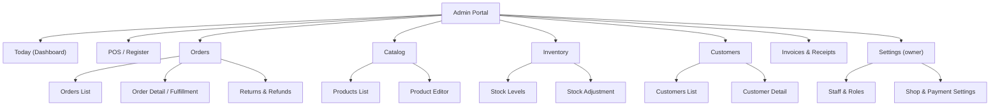
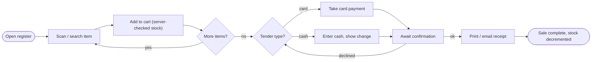
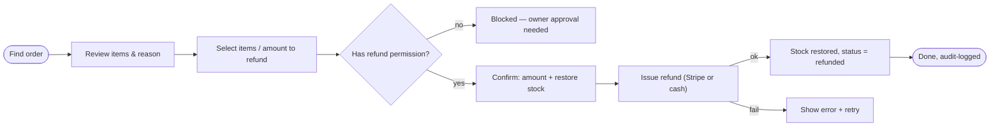
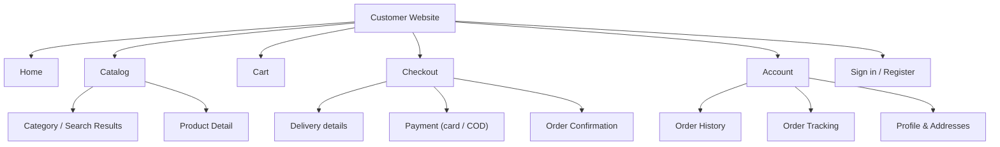
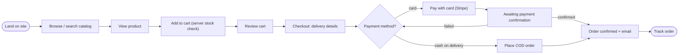
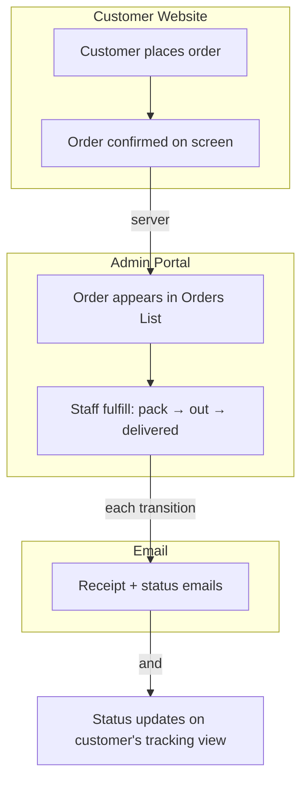

# UX Foundations: Shop Management System

> Status: Draft · Last updated: 2026-06-18 · Source: docs/architecture.md

## 1. Overview

The Shop Management System has **two UI surfaces** over one shared backend API, and this
document defines the design system both are assembled from — a single shared core plus a
per-surface profile, so the product feels like one thing without forcing a desktop pattern
onto a phone (or vice versa).

| Surface | Who it's for | Character |
|---------|--------------|-----------|
| **Admin Portal** | 3–5 shop staff (roles: `owner`, `cashier`) | Efficiency-first internal tool: POS at the counter + back-office. Desktop + keyboard, dense, learned once and used all day. |
| **Customer Website** | Consumers (first-time + returning) | Public storefront: browse, order, pay, track delivery. Mobile-first, trust-building, low-friction. |

**Design direction:** *trustworthy & clean* — calm neutral surfaces, one confident blue
accent, generous spacing, restrained motion. The look should read as *reliable*, because
the product moves money and stock. Frontend foundation is **Tailwind + shadcn/ui** (Radix
primitives, tokens as CSS variables) for both surfaces; English-only, left-to-right.

---

## Part A — Shared Core

The single design language inherited by every surface. Defined once here.

### A1. Brand and visual direction

No prior brand exists; this establishes it. The personality is **trustworthy, clean,
precise**:

- **Neutral-first.** Slate/gray surfaces and text carry the UI; color is used with intent,
  not decoration. White and near-white backgrounds, hairline borders, lots of breathing room.
- **One accent.** A single blue primary signals interactivity and brand. State colors
  (success/warning/danger/info) appear only to communicate status, never as styling.
- **Numbers matter.** Money and quantities are first-class — set in tabular (monospaced)
  figures so columns align and amounts are unambiguous. This is a design expression of the
  architecture's "money is exact" north star.
- **Quiet motion.** Short, soft transitions; nothing bouncy. Confidence, not flair.

A real logo/wordmark is TBD (see Part D); tokens below are logo-independent.

### A2. Voice and tone

**Voice:** plain, direct, reassuring. We say what happened and what to do next. No jargon,
no cleverness around money.

Tone flexes by surface and context — the **admin** is terser (staff are experts in a hurry);
the **website** is a touch warmer (consumers, some first-timers). Both stay calm under errors.

| Context | Do | Don't |
|---------|-----|-------|
| POS error | "Card declined. Try another card or take cash." | "Oops! Something went wrong 😬" |
| Out of stock (web) | "Only 2 left — added 2 to your cart." | "Inventory constraint exceeded." |
| Refund confirm (admin) | "Refund $24.00 to the original card? Stock will be restored." | "Are you sure?" |
| Order placed (web) | "Order #1042 confirmed. We'll email your receipt." | "Success!!!" |

Terminology is fixed and shared (see A6 / Part C): order statuses use the exact words from
the architecture's order state machine; never invent synonyms per screen.

### A3. Design tokens

Expressed as CSS custom properties feeding Tailwind. Light theme only at launch; tokens are
structured as semantic **roles** so a dark theme can be added as an alternate value set
without renaming anything (Part D).

**Color (semantic roles, light theme)**

| Role token | Value | Use / contrast note |
|------------|-------|---------------------|
| `--bg` | `#F8FAFC` | App background (slate-50) |
| `--surface` | `#FFFFFF` | Cards, panels, tables |
| `--surface-muted` | `#F1F5F9` | Subtle fills, table header, hover rows |
| `--text` | `#0F172A` | Primary text — 16:1 on surface |
| `--text-muted` | `#475569` | Secondary text — 7.5:1 on surface (AA for normal text) |
| `--border` | `#E2E8F0` | Hairline borders, dividers |
| `--primary` | `#1D4ED8` | Brand/interactive; white text = 5.9:1 (AA) |
| `--primary-hover` | `#1E40AF` | Hover/active for primary |
| `--primary-fg` | `#FFFFFF` | Text/icon on primary |
| `--secondary` | `#475569` | Neutral secondary actions |
| `--success` | `#15803D` | Paid / in-stock / delivered; white text = 4.8:1 |
| `--warning` | `#B45309` | Low stock / awaiting action |
| `--danger` | `#B91C1C` | Refunds, deletes, declines; white text = 6.4:1 |
| `--info` | `#0E7490` | Neutral status / informational |
| `--focus-ring` | `#2563EB` | Always-visible focus outline (2px + 2px offset) |

State colors each have a `-subtle` background pair (e.g. `--success-subtle: #DCFCE7`) for
status pills; foreground text on subtle backgrounds uses the strong role color, verified ≥ 4.5:1.

**Typography**

| Token | Family / value |
|-------|----------------|
| `--font-sans` | `Inter, system-ui, sans-serif` — all UI text |
| `--font-mono` | `"JetBrains Mono", ui-monospace, monospace` — money, quantities, SKUs, order #s |
| Scale | `xs 12/16 · sm 14/20 · base 16/24 · lg 18/28 · xl 20/28 · 2xl 24/32 · 3xl 30/36` (size/line-height px) |
| Weights | `400 regular · 500 medium · 600 semibold · 700 bold` |

Base size differs per surface via override (admin 14, web 16 — see B sections). Money is
always `--font-mono` with `font-variant-numeric: tabular-nums`.

**Spacing** — 4px base scale, used for all padding/margin/gap:

`0 · 1=4 · 2=8 · 3=12 · 4=16 · 5=20 · 6=24 · 8=32 · 10=40 · 12=48 · 16=64`

**Radius / elevation / borders**

| Token | Value |
|-------|-------|
| `--radius-sm / md / lg / xl` | `4 / 6 / 8 / 12 px`; `--radius-full 9999` |
| `--shadow-sm` | subtle 1px card lift |
| `--shadow-md` | dropdowns, popovers |
| `--shadow-lg` | modals, drawers |
| Border width | `1px` default; `2px` for focus ring |

**Iconography** — **Lucide** (ships with shadcn/ui), `1.5px` stroke, sizes `16 / 20 / 24`.
One icon per concept, consistent across surfaces (see Part C terminology).

**Motion** — durations `fast 120ms · base 180ms · slow 240ms`; easing `ease-out`
(`cubic-bezier(0.16, 1, 0.3, 1)` for entrances). All motion gated behind
`prefers-reduced-motion` (A5).

### A4. Core component inventory

Genuinely shared across both surfaces. shadcn/ui provides most as accessible Radix
primitives; we theme them with the tokens above. Each lists its responsibility; interactive
components implement the **shared state set** below.

| Component | Responsibility |
|-----------|----------------|
| **Button** | Actions in 4 intents: `primary`, `secondary`, `ghost`, `danger`; sizes sm/md; loading + disabled states. |
| **Icon button** | Compact icon-only action; must carry an accessible label. |
| **Text input / textarea / select** | Form fields with label, help, and error slot. |
| **Checkbox / radio / switch** | Boolean and choice inputs. |
| **Field** | Label + control + help + error wrapper; owns the validation/error display convention. |
| **Money display** | Renders a `Money` value: tabular mono, currency-formatted at the edge, never recomputed. Single source of money rendering across surfaces. |
| **Status pill** | The `OrderStatus` badge — fixed color mapping (A6), used in admin and customer order views alike. |
| **Toast** | Transient confirmation/error feedback (bottom on web, top-right on admin). |
| **Inline alert** | Persistent in-context message (info/warning/danger). |
| **Dialog / Drawer** | Modal interactions and side panels; focus-trapped. |
| **Confirm dialog** | Destructive-action confirmation (A6) — required for refunds, deletes, stock writes. |
| **Card** | Generic content container. |
| **Tabs / Accordion** | Sectioning within a page. |
| **Skeleton / Spinner** | Loading states for data views. |
| **Empty state** | Illustration + message + primary action for "no data yet". |
| **Pagination** | Paged lists/tables. |
| **Toast/nav primitives** | Menu, dropdown, tooltip — building blocks each surface composes into its own nav. |

**Shared interactive states (every control):** `default · hover · focus-visible · active ·
disabled · loading · error`. Focus is **always visibly rendered** (never removed).

**Data-view states (define once, used everywhere):** every list/table/detail handles
**loading** (skeleton), **empty** (empty-state component with a next action), **error**
(inline alert + retry), and **populated**. Partial/optimistic states are deliberately not a
pattern for money/stock (A6).

### A5. Accessibility standard

Target: **WCAG 2.2 AA**, made concrete as system-wide rules every component inherits:

- **Contrast:** text ≥ 4.5:1 (≥ 3:1 for large text and UI/graphical components). Tokens in
  A3 are chosen to meet this; don't introduce ad-hoc colors.
- **Focus:** a visible focus indicator on every interactive element (2px `--focus-ring` +
  2px offset). Never `outline: none` without a replacement.
- **Keyboard:** full operability without a mouse — critical for the admin/POS, which is
  keyboard-driven by design. Logical tab order; Escape closes dialogs; Enter submits.
- **Targets:** minimum hit target 24×24 CSS px (WCAG 2.2); the website uses ≥ 44px (its
  override) for thumb use.
- **Semantics:** real headings, labels tied to inputs, `aria-live` for toasts and async
  results, tables with proper headers.
- **Motion:** honor `prefers-reduced-motion` — disable non-essential transitions.

### A6. Cross-surface principles

Product-wide interaction rules that keep behavior predictable on both surfaces:

- **No optimistic UI for money or stock.** The UI shows a pending/working state and only
  reports success once the server confirms — never "pretends" then reconciles. This is the UX
  half of the architecture's invariants: an order shows **paid** only after the Stripe webhook
  confirms it, and "added to cart"/stock counts reflect server truth. Optimistic updates are
  fine for trivial, reversible things (e.g. toggling a UI preference), never for a sale.
- **Destructive actions are confirmed.** Refunds, deletions, manual stock adjustments, and
  price overrides require an explicit confirm dialog naming the consequence and amount, and are
  gated by role (cashier vs owner). These actions are audit-logged server-side.
- **One vocabulary, everywhere.** Order statuses use the exact state-machine names from the
  architecture; the **status-pill color map is fixed**: `pending_payment`/`awaiting_cod` →
  warning, `paid` → success(subtle), `packing`/`out_for_delivery` → info, `delivered` →
  success, `cancelled` → muted, `returned` → warning, `refunded` → danger(subtle). Same words,
  same colors, same icons in admin and on the customer's order view.
- **Money is rendered once.** Always through the shared Money display; formatted from integer
  minor units at the edge; never two formats for the same currency.
- **Errors explain and offer a way forward.** Every error states what happened and the next
  action (retry, choose another payment, contact). No dead ends, no raw error codes.

---

## Part B — Surfaces

### B1. Admin Portal

**Users and primary jobs.** 3–5 staff at a single shop, on a desktop/laptop at the counter
and in the back office, with a barcode scanner acting as keyboard input. Two roles: `cashier`
(sell, fulfill, look up) and `owner` (everything, plus refunds, pricing, stock edits, staff).
Optimized for **speed and density** over hand-holding. Top jobs:

1. Ring up an in-store sale at the POS (scan, tender card or cash, print/email receipt).
2. Fulfill online orders (accept → pack → out for delivery → delivered).
3. Process returns and refunds (and restore stock).
4. Manage inventory and stock levels (adjustments, low-stock visibility).
5. Manage the catalog (products, prices).
6. Look up customers and their order history.
7. (Owner) View the day's takings and manage staff/settings.

**Information architecture & navigation.** Persistent **left sidebar** (collapsible), with a
slim top bar for global search, the logged-in staff member, and the active register/shift.
Density favors a sidebar over top-nav because there are many sections used repeatedly.

**Key user flows.**

*POS sale (the most-used flow):*

*Issue a refund (role-gated, destructive):*

*Fulfill an online order:* `Orders List (new) → Order Detail → Accept → Pack → Mark
out-for-delivery → Mark delivered` (each transition writes server-side; the future courier
integration slots in at the dispatch step).

**Screen / page inventory** *(handoff to implementation planning)*:

| Screen | Purpose | Key states |
|--------|---------|-----------|
| Login | Staff sign-in | default, error |
| Today (Dashboard) | Day's sales, pending fulfillments, low-stock alerts | loading, empty, populated |
| POS / Register | Ring up sales: item search/grid + cart + tender | empty cart, item added, payment pending, declined, complete |
| Tender dialog | Card/cash payment capture + change | card pending, cash, error |
| Receipt view | Printable/emailable receipt | — |
| Orders List | All orders, filter by status/channel | loading, empty, populated, filtered |
| Order Detail / Fulfillment | Line items, status timeline, fulfillment actions | by status; permission-gated actions |
| Returns & Refunds | Initiate/track refunds for an order | select items, confirm, processing, done, error |
| Products List | Catalog browse/search, stock at a glance | loading, empty, populated |
| Product Editor | Create/edit product, price, SKU | new, edit, validation error, saved |
| Stock Levels | On-hand per product, low-stock flags | populated, low-stock |
| Stock Adjustment | Manual adjustment with reason (audit-logged) | confirm, error |
| Customers List | Search customers | loading, empty, populated |
| Customer Detail | Profile + order history | populated |
| Invoices & Receipts | Find/reprint invoices & receipts | populated, empty |
| Staff & Roles (owner) | Manage staff accounts and roles | populated, confirm-remove |
| Shop & Payment Settings (owner) | Shop info, payment/email config | default, saved |

**Surface-specific components:**

| Component | Spec |
|-----------|------|
| **Data table** | Sortable, filterable, paginated; row selection + bulk actions; compact density; keyboard navigable. The admin workhorse. |
| **POS register layout** | Two-pane: product search/grid (left) + live cart with running total (right); keyboard-first; barcode focuses the search. |
| **Tender dialog** | Card vs cash, cash-tendered → change calc, payment-pending state. |
| **Stat card** | Single KPI for the dashboard (takings, orders, low-stock count). |
| **Detail/edit drawer** | Side panel for record detail/edit without losing list context. |
| **Status timeline** | Vertical order-lifecycle timeline with the current state highlighted. |
| **Print view** | Print-stylesheet layout for receipts/invoices. |
| **Role-gated action** | Wrapper that hides/disables actions by RBAC and routes to the confirm dialog. |

**Token overrides (vs core):** base font `14px` (denser); compact spacing on table rows and
toolbars (use `space-2`/`space-3` where the website uses `space-4`); table row height tuned
for scanning. No color or radius changes — it stays visibly the same product.

### B2. Customer Website

**Users and primary jobs.** Consumers on their **phones** (mobile-first; must also work on
desktop), a mix of first-time and returning shoppers, buying with low patience for friction.
No training, maximum clarity. Top jobs:

1. Browse and search the catalog.
2. View a product and add it to the cart.
3. Check out and pay — **card (Stripe) or cash on delivery**.
4. Create an account / sign in.
5. Track an order and its delivery status.
6. Review past orders and receipts.

**Information architecture & navigation.** **Top nav** with a persistent cart affordance;
on mobile it collapses to a hamburger + a bottom-anchored cart/checkout bar. Shallow,
conversion-oriented IA.

**Key user flows.**

*Browse → buy (mirrors architecture §6.1):*

*Track an order:* `Account → Order History → Order Tracking` (status timeline mirrors the
admin's, same vocabulary and colors).

*Sign up / sign in:* standard email + password (customer realm), with guest checkout allowed
up to payment, then prompt to save an account.

**Screen / page inventory** *(handoff to implementation planning)*:

| Screen | Purpose | Key states |
|--------|---------|-----------|
| Home | Entry, featured products, search | loading, populated |
| Category / Search Results | Browse/filter/sort products | loading, empty (no results), populated |
| Product Detail | Images, price, stock, add to cart | in stock, low stock, out of stock |
| Cart | Review items, adjust quantities | empty, populated, item-removed |
| Checkout — Delivery | Address & contact | default, validation error |
| Checkout — Payment | Card (Stripe element) or COD | card entry, pending, declined, COD |
| Order Confirmation | Confirmed order summary | success |
| Sign in / Register | Customer auth | default, error |
| Order History | Past orders | loading, empty, populated |
| Order Tracking | Status timeline + delivery state | by status |
| Profile & Addresses | Manage details & saved addresses | populated, saved |

**Surface-specific components:**

| Component | Spec |
|-----------|------|
| **Product card** | Image, name, price (Money), stock cue, add-to-cart; the catalog unit. |
| **Product gallery** | Image viewer on the product page. |
| **Cart drawer / bar** | Slide-in cart on desktop; sticky bottom bar on mobile. |
| **Checkout stepper** | Delivery → Payment → Confirmation progress. |
| **Stripe payment element** | Wrapper around Stripe's hosted card element (PCI stays out of scope). |
| **Address form** | Reusable delivery-address capture/edit. |
| **Order status timeline** | Customer-facing version of the lifecycle (shared status vocabulary/colors). |
| **Category / filter nav** | Mobile-friendly facets and sort. |

**Token overrides (vs core):** base font `16px`; minimum touch target `44px`; more generous
spacing (lean on `space-4`/`space-6`). Same palette, type families, and radii as the admin —
the shared core is intact; only density and target sizes diverge.

---

## Part C — Cross-Surface Reconciliation

Two web surfaces on one core, so this is light — most divergence is density and IA, not
component duplication.

- **Shared vs surface-specific.** The core (A4) is the shared library: buttons, fields,
  feedback, dialogs, **Money display**, and the **Status pill**. The **order status timeline**
  appears on both surfaces — it is **promoted to the shared core** (one component, two
  densities) rather than built twice, because the customer's tracking view and the admin's
  fulfillment view are the same concept. Genuinely surface-specific: the admin **data table**
  and **POS register** (admin only); the **product card**, **cart**, and **checkout stepper**
  (website only).
- **Flows that span surfaces.** The central journey crosses both surfaces and email:

  Coherence rule: the customer's tracking view and the staff fulfillment view are driven by
  the **same order status** — when staff advance the order, the customer's timeline and the
  email reflect the identical state and wording.
- **Consistency rules (must stay identical):** order-status vocabulary and pill colors; money
  formatting; icon-to-concept mapping; the "no optimistic UI for money/stock" rule; the
  destructive-action confirm pattern. **Deliberately allowed to differ:** base font size,
  density/spacing, target sizes, and navigation model (sidebar vs top nav) — these track the
  device and user context, not brand drift.

---

## Part D — Open Questions and Risks

- **No dark theme at launch.** Out of scope for v1; tokens are defined as semantic roles so a
  dark set can be added later without renaming. Confirm this is acceptable.
- **Logo / wordmark TBD.** The system is logo-independent, but a real mark is needed before
  launch; it may nudge the accent hue.
- **Receipt/invoice printing hardware unknown.** A print stylesheet is specified, but thermal-
  printer vs A4 and whether receipts print or email-only affects the receipt component. Needs a
  decision.
- **Barcode scanner assumed keyboard-wedge** (types the code + Enter into the focused search).
  If a different scanner model is used, the POS input handling may need adjustment.
- **Tablet POS deferred, not foreclosed.** We chose desktop+keyboard; target sizes are kept
  reasonable so a future touch POS is possible, but a true tablet register would warrant its
  own surface profile.
- **Catalog search depth.** Simple list/filter is specified; if the catalog grows large, search
  UX (typeahead, facets) may need investment beyond what Postgres queries comfortably serve.
- **Validate with real staff.** The POS keyboard flow and refund gating should be tested with
  the actual cashiers early — counter speed is the make-or-break of the admin surface.
